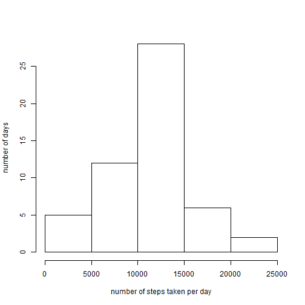
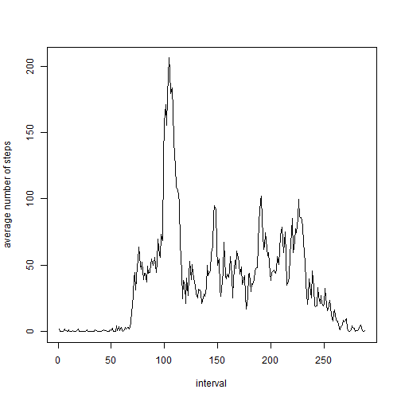
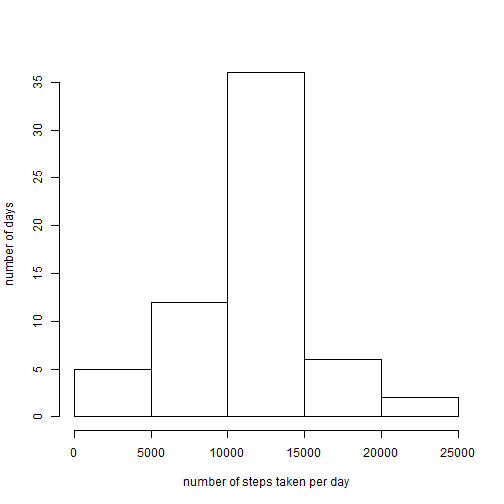
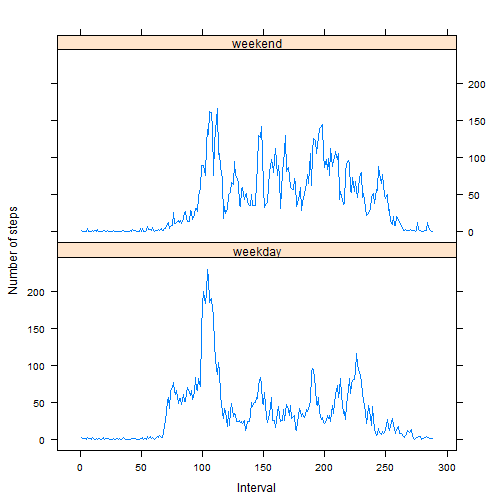

For the scope of the assignment please see the README.md file

## Loading and preprocessing the data
The data set for this assessment is suplied in the GitHub repository so I will assume that it is already downloaded and present in the directory where the R markdown script is run. However if that is not the case and the data needs to be downloaded manually, then it can be found here: [Activity monitoring data](https://d396qusza40orc.cloudfront.net/repdata%2Fdata%2Factivity.zip) [52K]

  Show any code that is needed to

  1. Load the data (i.e. read.csv())

  First unpack the compressed file, then load into a dataframe:

```r
unzip("./activity.zip")
activityLog<-read.csv("activity.csv")
```

  2. Process/transform the data (if necessary) into a format suitable for your analysis. **Answer:** *Colomn "interval" is actually time of day and needs renaming and reformatting to propper time format. Then there is a need for a colomn keeping track of which interval given measurement is related to. Removing of NA's or recunstructing values will be done below.*


The original dataset:

```r
head(activityLog)
```

```
##   steps       date interval
## 1    NA 2012-10-01        0
## 2    NA 2012-10-01        5
## 3    NA 2012-10-01       10
## 4    NA 2012-10-01       15
## 5    NA 2012-10-01       20
## 6    NA 2012-10-01       25
```

The transformed dataset:

```r
time<-substr(as.POSIXct(sprintf("%04.0f", activityLog$interval), format='%H%M'), 12, 16)
interval<-rep(c(1:288),61)
actLogTrans<-cbind.data.frame(activityLog$steps,activityLog$date,time,interval)
colnames(actLogTrans)<-c("steps","date","time","interval")
head(actLogTrans)
```

```
##   steps       date  time interval
## 1    NA 2012-10-01 00:00        1
## 2    NA 2012-10-01 00:05        2
## 3    NA 2012-10-01 00:10        3
## 4    NA 2012-10-01 00:15        4
## 5    NA 2012-10-01 00:20        5
## 6    NA 2012-10-01 00:25        6
```

## What is mean total number of steps taken per day?
For this part of the assignment, you can ignore the missing values in the dataset.

  1.  Calculate the total number of steps taken per day
  
      First we need to remove all NA's from the dataframe and then addregate over dates:


```r
actLogCompCases<-actLogTrans[complete.cases(actLogTrans),]
stepsPerDay<-aggregate(actLogCompCases$steps,by=list(actLogCompCases$date),FUN=sum)
colnames(stepsPerDay)<-c("interval","totalStepsPerDay")
```

  2.  If you do not understand the difference between a histogram and a barplot, research the difference between them. Make a histogram of the total number of steps taken each day


```r
hist(stepsPerDay$totalStepsPerDay,xlab="number of steps taken per day",ylab="number of days",main="")
```

 

From the histogram we can see that the most frequent number of steps in a day is between 10.000-15.000.

  3.  Calculate and report the mean and median of the total number of steps taken per day
  
Mean of steps taken per day:

```r
mean(stepsPerDay$totalStepsPerDay)
```

```
## [1] 10766.19
```

Median of steps taken per day:

```r
median(stepsPerDay$totalStepsPerDay)
```

```
## [1] 10765
```


## What is the average daily activity pattern?

  1. Make a time series plot (i.e. type = "l") of the 5-minute interval (x-axis) and the average number of steps taken, averaged across all days (y-axis)
  
Here we need to aggregate the data in each interval:

```r
stepsPerInterval<-aggregate(actLogCompCases$steps,by=list(actLogCompCases$interval),FUN=mean)
colnames(stepsPerInterval)<-c("interval","avgSteps")
head(stepsPerInterval)
```

```
##   interval  avgSteps
## 1        1 1.7169811
## 2        2 0.3396226
## 3        3 0.1320755
## 4        4 0.1509434
## 5        5 0.0754717
## 6        6 2.0943396
```

```r
plot(stepsPerInterval$interval,stepsPerInterval$avgSteps,type="l",xlab="interval",ylab="average number of steps")
```

 
  
  
  2. Which 5-minute interval, on average across all the days in the dataset, contains the maximum number of steps?

Here we need to find the highest number of steps in an interval:


```r
max(stepsPerInterval$avgSteps)
```

```
## [1] 206.1698
```
when the average steps are sorted in decreasing order the first value will indicate the interval with the highest number of steps


```r
sort.list(stepsPerInterval$avgSteps,decreasing = TRUE)
```

```
##   [1] 104 105 107 106 103 101 108 100 102 109  99 110 111 112 113 191 226
##  [18] 190 114 147 148 146 227 228 225 220 229 192 189 210 230 223 213 219
##  [35] 195 224  97 209  94 211  98 222 156 115 188 194 145  76 149 196 193
##  [52] 208 168 198 212 221 144 231 218  95 197 214 162 206  96 169  91  88
##  [69] 151  75 166 232 124  93  79 170  90 126 207  87 150 140  77  89  74
##  [86]  84 172 187 186 167  78 205 161 203 143 185 239 202 116 155 201 142
## [103]  72  86  92 127  82  81 199  85 180 204 179 171 159 163 123 157 141
## [120] 175 160 217 121 236 165 158  71  80 125 184 118 200 154 174 216 128
## [137]  83 233 182 183 173 119 215 129 240 139 244 152 251 132  73 133 237
## [154] 181 134 137 130 176 235 247 122 245 153 138 178 136 238 164 131 117
## [171] 255 248 135 250 246 120 234 252 241 249 243 256 242  70 254 177 260
## [188]  69 253 259 257 271 270 261 268 263 258 262 269  68 267 284 276  55
## [205] 266  57  65 277 285  59  63  66 278 264 283  51  64 272   6  67  19
## [222]   1  43 275 282  62  35  10 265  49  27  18  60 288 281  36  50   8
## [239]  58 280  14  56 286  42  44   7  45  22  54   2  16  53  13 273  11
## [256]  23  32 287  41  20  21   4  15   3  12  30 274   5  46   9  17  24
## [273]  25  26  28  29  31  33  34  37  38  39  40  47  48  52  61 279
```

```r
stepsPerInterval[sort.list(stepsPerInterval$avgSteps,decreasing = TRUE)[1],]
```

```
##     interval avgSteps
## 104      104 206.1698
```
Which coresponds in time to

```r
actLogCompCases$time[sort.list(stepsPerInterval$avgSteps,decreasing = TRUE)[1]]
```

```
## [1] 08:35
## 288 Levels: 00:00 00:05 00:10 00:15 00:20 00:25 00:30 00:35 00:40 ... 23:55
```

## Imputing missing values
Note that there are a number of days/intervals where there are missing values (coded as NA). The presence of missing days may introduce bias into some calculations or summaries of the data.


  1. Calculate and report the total number of missing values in the dataset (i.e. the total number of rows with NAs)
  
Total number of missing values:

```r
sum(is.na(activityLog$steps))
```

```
## [1] 2304
```

  2. Devise a strategy for filling in all of the missing values in the dataset. The strategy does not need to be sophisticated. For example, you could use the mean/median for that day, or the mean for that 5-minute interval, etc.

Scope:	Write a function that checks if number of steps is a NA and if so replace it with the calculated mean for this interval. Then we can apply the function to the steps column.


```r
replaceNA<-function(steps,interval){
correctedSteps=0
if(is.na(steps)){
  correctedSteps=stepsPerInterval$avgSteps[interval]
}else{
	correctedSteps=steps
}
return(correctedSteps)
}
```

  3. Create a new dataset that is equal to the original dataset but with the missing data filled in.


```r
corrSteps<-mapply(replaceNA,actLogTrans$steps,actLogTrans$interval)
actLogTransCorrected<-cbind.data.frame(corrSteps,actLogTrans$date,actLogTrans$time,actLogTrans$interval)
colnames(actLogTransCorrected)<-c("steps","date","time","interval")
head(actLogTransCorrected)
```

```
##       steps       date  time interval
## 1 1.7169811 2012-10-01 00:00        1
## 2 0.3396226 2012-10-01 00:05        2
## 3 0.1320755 2012-10-01 00:10        3
## 4 0.1509434 2012-10-01 00:15        4
## 5 0.0754717 2012-10-01 00:20        5
## 6 2.0943396 2012-10-01 00:25        6
```


  4. Make a histogram of the total number of steps taken each day and Calculate and report the mean and median total number of steps taken per day. Do these values differ from the estimates from the first part of the assignment? What is the impact of imputing missing data on the estimates of the total daily number of steps?


```r
corrStepsPerDay<-aggregate(actLogTransCorrected$steps,by=list(actLogTransCorrected$date),FUN=sum)
colnames(corrStepsPerDay)<-c("interval","totalStepsPerDay")
hist(corrStepsPerDay$totalStepsPerDay,xlab="number of steps taken per day",ylab="number of days",main="")
```

 

Mean of steps taken per day:

```r
mean(corrStepsPerDay$totalStepsPerDay)
```

```
## [1] 10766.19
```

Median of steps taken per day:

```r
median(corrStepsPerDay$totalStepsPerDay)
```

```
## [1] 10766.19
```

**Answer:** The mean does not change as I filled in more average values into the data set, the median is shifted to the mean value for that particular rason. The impact of inserting missing data shifts the general structure of the original data and one needs to be very cautios of that since it might change the conclusions reached at the end of analysis.


## Are there differences in activity patterns between weekdays and weekends?
For this part the weekdays() function may be of some help here. Use the dataset with the filled-in missing values for this part.

  1. Create a new factor variable in the dataset with two levels - "weekday" and "weekend" indicating whether a given date is a weekday or weekend day.
  

First making sure the day names are outputed in English

```r
Sys.setlocale("LC_TIME", "English")
```

```
## [1] "English_United States.1252"
```

```r
weekendDays <- c("Saturday","Sunday")
actLogTransCorrected$wDay <- factor((weekdays(as.POSIXct(actLogTransCorrected$date)) %in% weekendDays), 
  		levels=c(FALSE, TRUE), labels=c("weekday","weekend"))
```


  2. Make a panel plot containing a time series plot (i.e. type = "l") of the 5-minute interval (x-axis) and the average number of steps taken, averaged across all weekday days or weekend days (y-axis). See the README file in the GitHub repository to see an example of what this plot should look like using simulated data.


```r
library("lattice")
stepsPerIntervalWeek<-aggregate.data.frame(actLogTransCorrected$steps,by=list(actLogTransCorrected$interval, actLogTransCorrected$wDay),FUN=mean,simplify=TRUE)
colnames(stepsPerIntervalWeek)<-c("interval","wDay","stepsPerInterval")
activityplot<-xyplot(stepsPerIntervalWeek$stepsPerInterval~stepsPerIntervalWeek$interval|stepsPerIntervalWeek$wDay, type="l",main="",ylab="Number of steps", xlab="Interval",layout=(c(1,2)))
print(activityplot)
```

 

The number of steps per interval seems to be generally higher in the weekends, but the highest isolated amount is on the weekdays. Seems that the person is rushing to the office in the morning and spends more passive time during the day, possibly at a desk.
